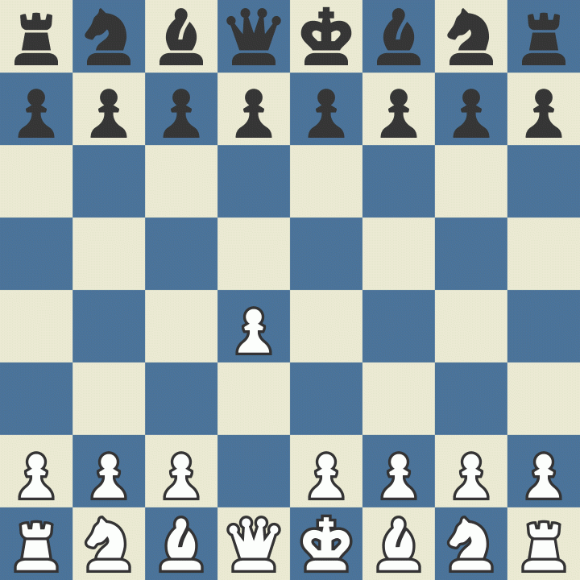
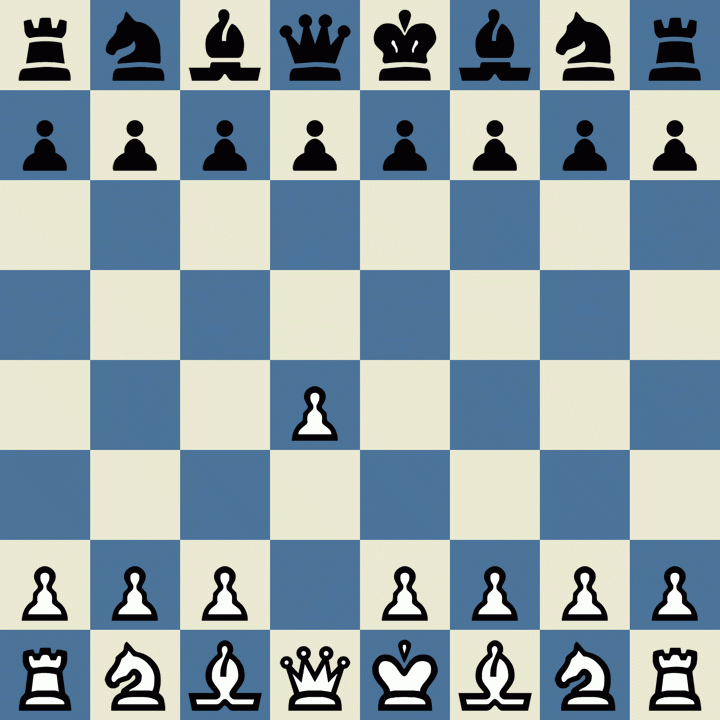

# Alphazero's little offspring

Deepmind's Alphazero has conquered number of games in the last few years, which created a strong urge to understand the inner workings of this approach. Turned out to be easier than I initially thought - it does not look like a rocket science and the number of lines of code is rather modest. Then, on second thought, if you stand on the shoulders of the giants, things seem way easier than they really are. Alphago team probably spent countless hours investigating different options, Python Chess package has taken years to develop, Zeta's initial version must have taken hundreds of hours to implement. Given unlimited compute power to compensate for Python's speed and enough time to iron out the inevitable bugs a code rather similar to this should eventually produce a strong chess AI.  

## A. What can you do with this code?

If you want to learn how AlphaZero works using someone else's code, the Leela's predecessor is the way to go. My code is a much simpler derivative of this great work and built for a narrow purpose of obtaining a high-level understanding how Alpha Zero works. 

In any case, this code can be used to:
1. Create positions and games for the neural network
2. Train the neural network
3. Play games using the trained network

This code most likely contains more than one bug and the balance between exploration/explotation is far from being optimal. However, I tried all key components of Alpha Zero as presented in the reference [3] (though not all of them are available in this version of the code).

## B. Examples

The Tensorflow model is trained on ca 1m games for 12 hours. Somewhat surprisingly the model model started overfitting only after 2 epochs even after trying different parameter values. Probably the Elo of the model included in the code is between 1400-1600 points.  The engine has a real difficulty with winning the end games and the openings are less than spectacular. For this reason the average game is not especially impressive.

However, the engine performs clearly better than a random player as evidenced by these two games:
<table><tr>
<td>  </td>
<td>  </td>
</tr></table>

## C. References

1. This work was heavily inspired by [Zeta36's repository, the predecessor of Leela Zero](https://github.com/Zeta36/chess-alpha-zero), but for better or worse large parts of the code is original
2. I could not have done it without an excellent package from [Niklas Fiekas, the author of Python Chess](https://github.com/niklasf/python-chess)
3. An excellent cheat sheet [by David Foster](https://medium.com/applied-data-science/alphago-zero-explained-in-one-diagram-365f5abf67e0) helped me out more than once 
4. The journey began here: [AlphaZero: Shedding new light on chess, shogi, and Go](https://deepmind.com/blog/article/alphazero-shedding-new-light-grand-games-chess-shogi-and-go)

## D. SQL database

The following scripts were used to create and populate the sql database. Using the Keras generator and pre-splitting the dataset into smaller pieces, one epoch processing ca 500 GB of positions took around 3 hours to complete on RTX 4000.

**Create table:**
~~~~sql
CREATE TABLE chess.dbo.games (
    Id int IDENTITY(1,1) PRIMARY KEY,
    GameNum int NOT NULL,
    MoveNum int NOT NULL,
    Fen varchar(100) NOT NULL,
    Result varchar(10) NOT NULL,
    NextMove varchar(5) NOT NULL,
    Algo varchar(20) NOT NULL,
    MoveTensorBinary binary(1968) NOT NULL,
    FenTensorBinary binary(768) NOT NULL,
    ResultTensor int NOT NULL,
    CreatedDate datetime DEFAULT(getdate())
);
~~~~

**Create an index to retrieve random rows:**
~~~~sql
ALTER TABLE chess.dbo.games add RandIndex UNIQUEIDENTIFIER DEFAULT NEWID() NOT NULL

WITH T AS
(SELECT  Id, RandRow,
         ROW_NUMBER() OVER (ORDER BY [RandIndex]) AS RN
 FROM    chess.dbo.games
)
UPDATE  T
SET RandRow = RN
~~~~

## E. Varia 
The "sf_bindings" directory contains files that are required for creating Pybind11 and cppyy Python-C++ bindings between Stockfish and Python code. In the end, speeding up move-generation part of the code resulted in only modest gains at the cost of non-trivial complexity, which is why it is not used in the current version of the code. 